# M-Radl
*Ride Safe and Sound. Know Your Way Around! - the smarter way to cycle Munich*  
*[📄🎤 View the pitch presentation (PDF)](public/Pitch.pdf)*  

---

### 🧭 Navigation Modes ###
M-Radl strives to make biking around Munich safer and more comfortable. It provides multiple routing options, such as a standard navigatio mode, a Safe Mode to ride securely at night by avoiding dark areas, and a Cool Mode that analyzes and combines multiple data sources to calculate the shadiest route during the summer heat. 

  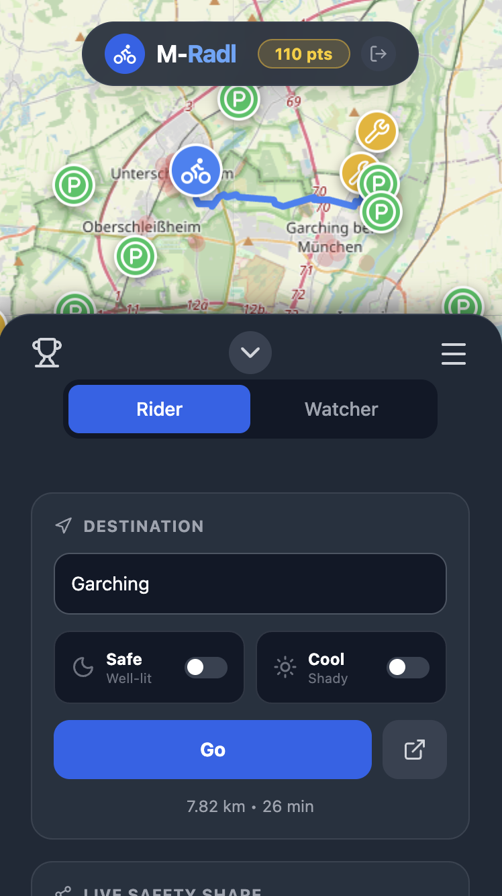
  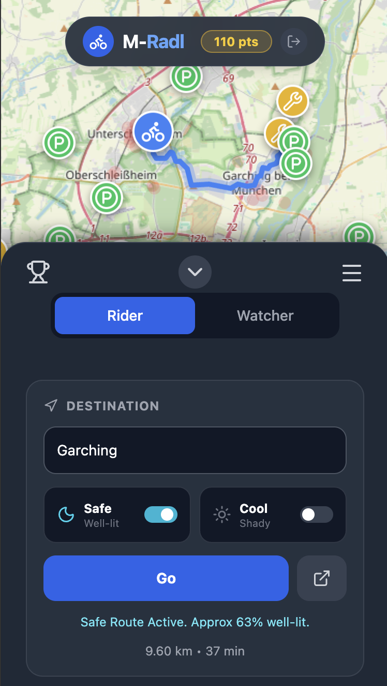
  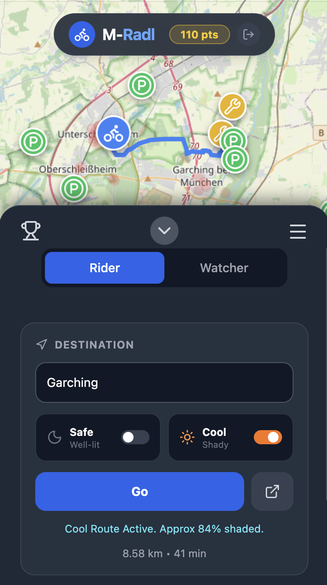

 

### 🎮 Crowdsourcing with gamification ###
It also uses a crowdsourcing approach where users can easily mark locations of bike racks, repair stations, and report theft zones to create Danger Zones that inform and warn other users. To increase user engagement the web app is gamified with a leaderboard, where bikers earn points by reporting thefts or the location of repair stations and bike racks.
    

  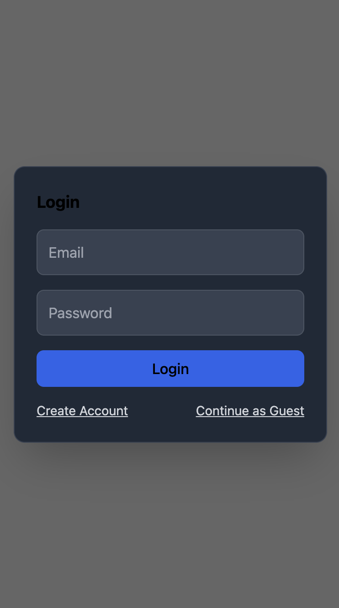
  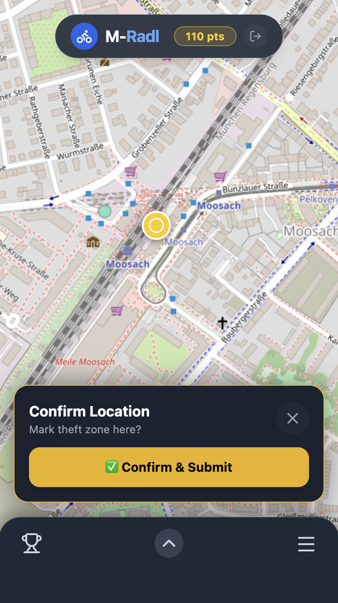
  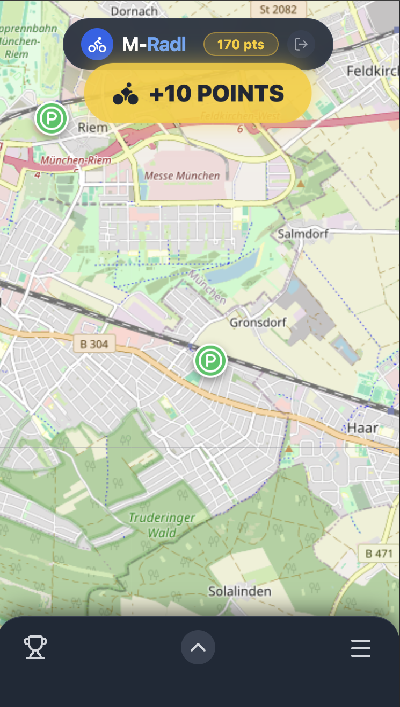
  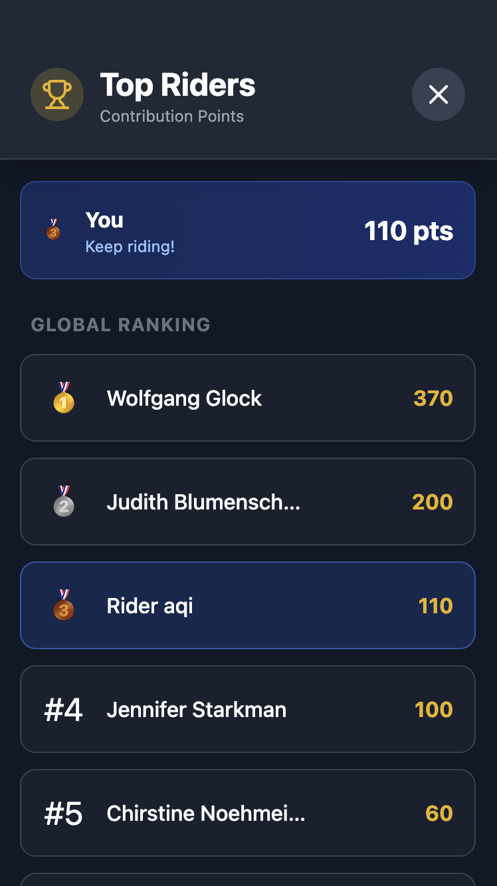

### 🛡️ Watcher Mode ###   
Through our Watcher Mode, a rider can generate a unique Trip ID and share it with a friend. The friend can watch their live location on a map and is notified if the rider stops moving inside a known Danger Zone.

  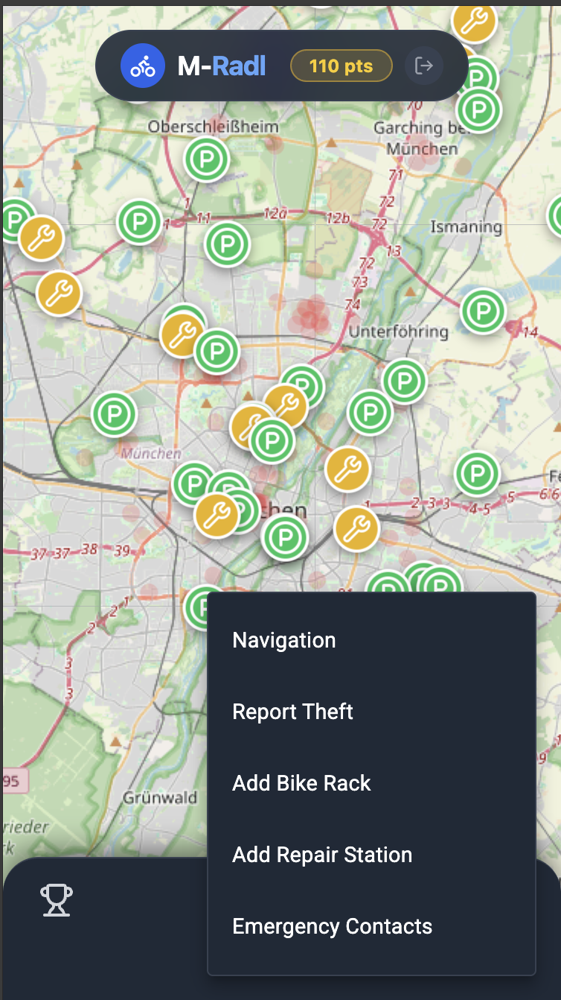
  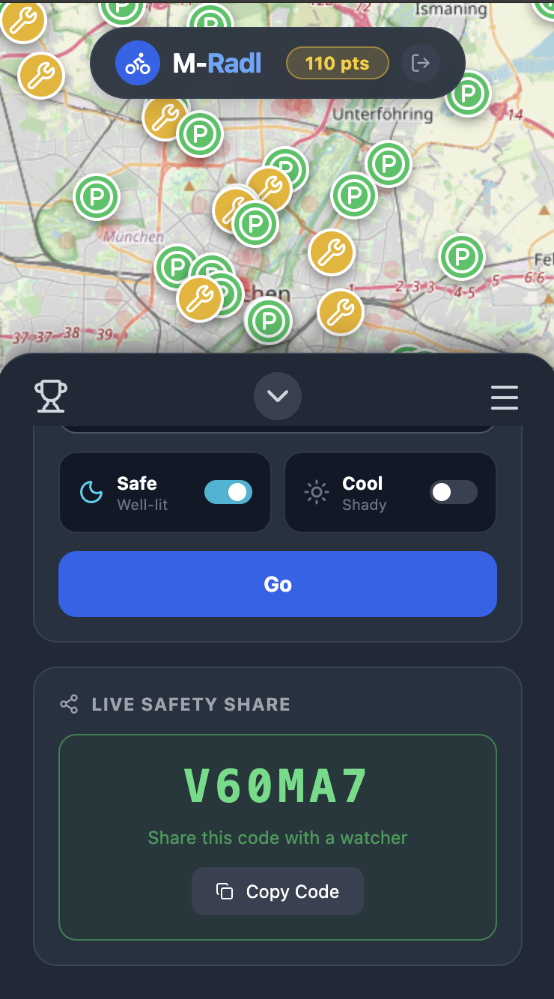
  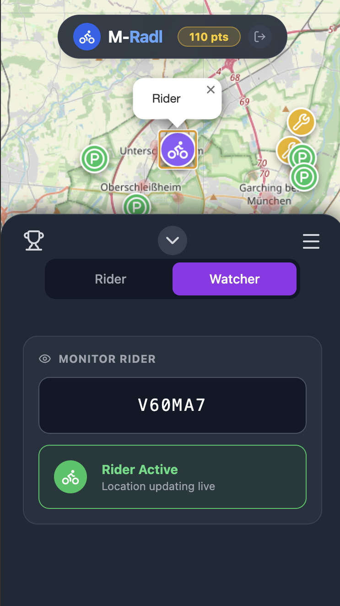

 

### 🚨 Emergency Contacts ###
Finall, M-Radl provides easy to access emergency numbers that bikers can call to directly contact emergency services, without having to leave the app.

  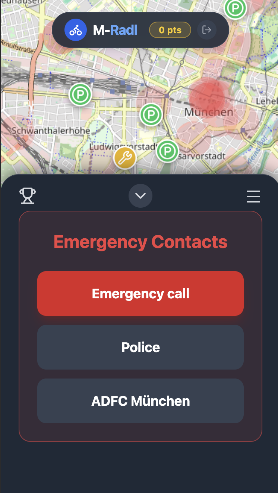

  
---

Hackatum November 2025 | 2nd Place (Landeshauptstadt München) | Community Award Winner

---

